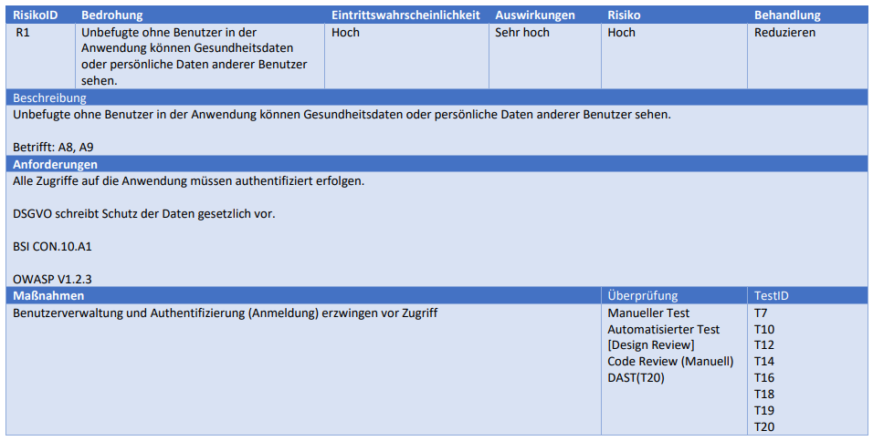

# Dokumentation SbD - Projekt HealthApp <!-- omit in toc -->

## Inhaltsverzeichnis <!-- omit in toc -->
- [Technologien und Tools](#technologien-und-tools)
  - [Django](#django)
  - [Gunicorn](#gunicorn)
  - [Nginx](#nginx)
  - [Docker](#docker)
  - [PostgreSQL](#postgresql)
- [Architektur](#architektur)
- [Schutzobjekte und Schutzziele](#schutzobjekte-und-schutzziele)
- [Risikoregister](#risikoregister)
- [Implementierung](#implementierung)
  - [User Registrierung](#user-registrierung)
    - [E-Mail Bestätigung](#e-mail-bestätigung)
  - [User Login](#user-login)
  - [Datei Verschlüsselung](#datei-verschlüsselung)
  - 
- [Testplan](#testplan)
- [Testergebnisse](#testergebnisse)

## Technologien und Tools
### Django
Django ist ein High-Level-Python-Webframework, das eine schnelle Entwicklung und ein sauberes, pragmatisches Design fördert. Es wurde von erfahrenen Entwicklern erstellt und nimmt Ihnen einen Großteil der Webentwicklung ab, sodass Sie sich auf das Schreiben Ihrer App konzentrieren können, ohne das Rad neu erfinden zu müssen. Es ist kostenlos und Open Source.
### Gunicorn
Gunicorn ist ein Python-WSGI-HTTP-Server für UNIX. Der Gunicorn-Server ist weitgehend kompatibel mit verschiedenen Web-Frameworks, ist vergleichsweise einfach implementiert, verbraucht wenig Serverressourcen und ist vergleichsweise schnell
### Nginx
Nginx (Engine X) ist ein Open-Source-Webserver, der für die Verarbeitung von HTTP-Anfragen und die Bereitstellung von Inhalten konzipiert ist. Nginx ist ein beliebter Webserver, der für seine hohe Geschwindigkeit und seine Fähigkeit bekannt ist, große Anfragen zu verarbeiten. Nginx ist ein beliebter Webserver, der für seine hohe Geschwindigkeit und seine Fähigkeit bekannt ist, große Anfragen zu verarbeiten.
### Docker
Docker ist eine Software, die es Entwicklern ermöglicht, Anwendungen in isolierten Umgebungen zu erstellen, zu testen und zu bereitstellen.
### PostgreSQL
PostgreSQL ist ein objektrelationales Datenbankmanagementsystem (ORDBMS) mit dem Fokus auf Standardskonformität und Erweiterbarkeit.
## Architektur

## Schutzobjekte und Schutzziele

## Risikoregister

## Implementierung
### User Registrierung
#### E-Mail Bestätigung
### User Login
### Datei Verschlüsselung
### 

## Testplan
|Test Case Type|Beschreibung|Test Schritte|Erwartetes Ergebnis|Status|
|----------|----------|--------|--------|----------|
| Functionality|Testen ob Nutzer erstellt und gelöscht werden kann|Mehrere Nutzer erstellen und danach löschen|Nutzer lässt sich erfolgreich erstellen und wieder löschen|Passed|
||Testen ob Login/Logout funktioniert|Erstellte Testnutzer einloggen und auf gültige bzw. nach dem Logout ungültige Session prüfen|Nach dem einloggen wird eine gültige Session erstellt und diese wird nach dem ausloggen ungültig und ist nicht mehr nutzbar|Passed|
||Testen ob Nutzer aktiv oder inaktiv - bei Inaktiv User löschen|Prüfen ob erstellte Nutzer ihre E-Mail verifiziert haben (und somit inactiv sind), falls die Verifizierung nicht erfolgt wird kein Konto erstellt und der Nutzer wieder gelöscht|Nicht verifizierte Konten werden identifiziert und dann gelöscht|Passed|
||Testen ob Patient/Doktor erstellbar|Nutzer mit Rollenzuweisung(Patient/Doktor) erstellen|Nutzer werden erstellt und entweder der Rolle Patient oder Doktor erfolgreich zugewiesen|Passed|
||Testen ob File Upload/Download funktioniert  |Eine PDF Datei hochladen/runterladen und auf gültige Rückmeldung prüfen|Es lässt sich eine PDF Datei hochladen und auch wieder herunterladen||
|Security|Zugriff auf Myfiles/shared files ohne Patientenrolle testen|MyFiles und SharedFiles aufrufen ohne eingeloggt oder registriert zu sein |Es ist nicht möglich auf MyFiles oder SharedFiles zuzugreifen|Passed|
||Zugriff auf Profile ohne Patientenrolle testen|Profile aufrufen ohne ein Doktorrolle zu haben    |Profil darf nicht abrufbar sein|Passed|
||Zugriff auf All Doctors/My Doctors ohne Patientenrolle testen| All Doctors/ My Doctors - Seite aufrufen ohne ein Patientenrolle zu haben       |Zugriff auf die Seite darf nicht möglich sein ohne ein Patientenrolle zu haben|Passed|
||Zugriff auf Patient Data/Patient Request ohne Doktorrolle testen| Patient data bzw. Patient Request aufrufen ohne Doktorrolle zu besitzen     |Es darf keine Datenabruf möglich sein, wenn man keine Doktorrolle hat und Doktor vom jeweiligen Patienten ist|Passed|
| Security|Testen ob Email Verifzierung mit falschem Token|Falschen Token für nicht aktiven Nutzer erstellen und mit GET-Request prüfen ob damit die E-Mail verifizierbar ist|Eine E-Mail Verifizierung mit dem falschen Token darf nicht erfolgen|Passed|
| Usability|||||
## Testergebnisse

https://app.fossa.com/attribution/e255cdb3-2448-49e1-89d8-503bb1d49d38