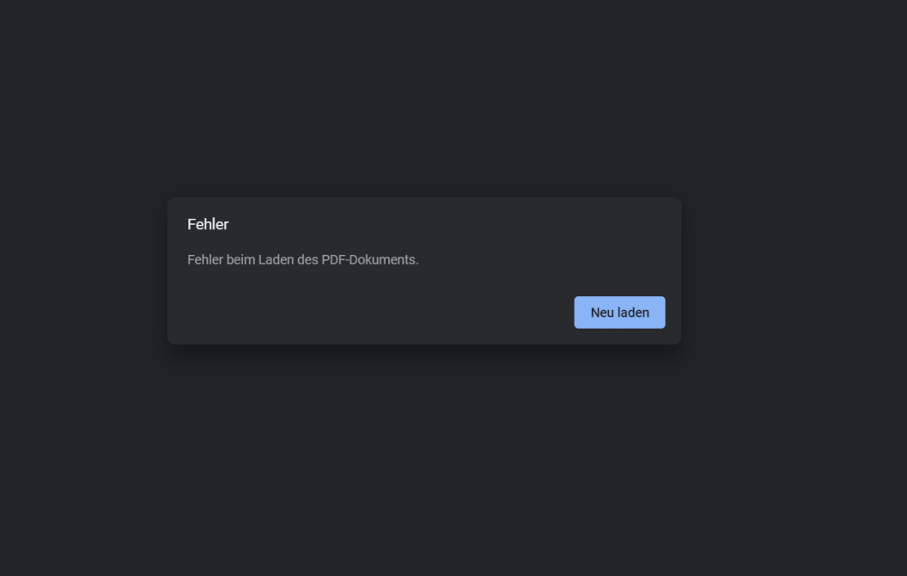
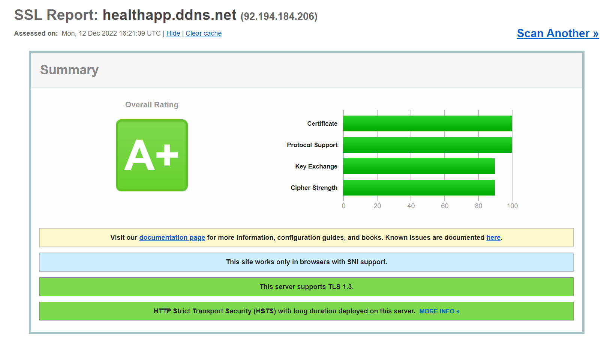
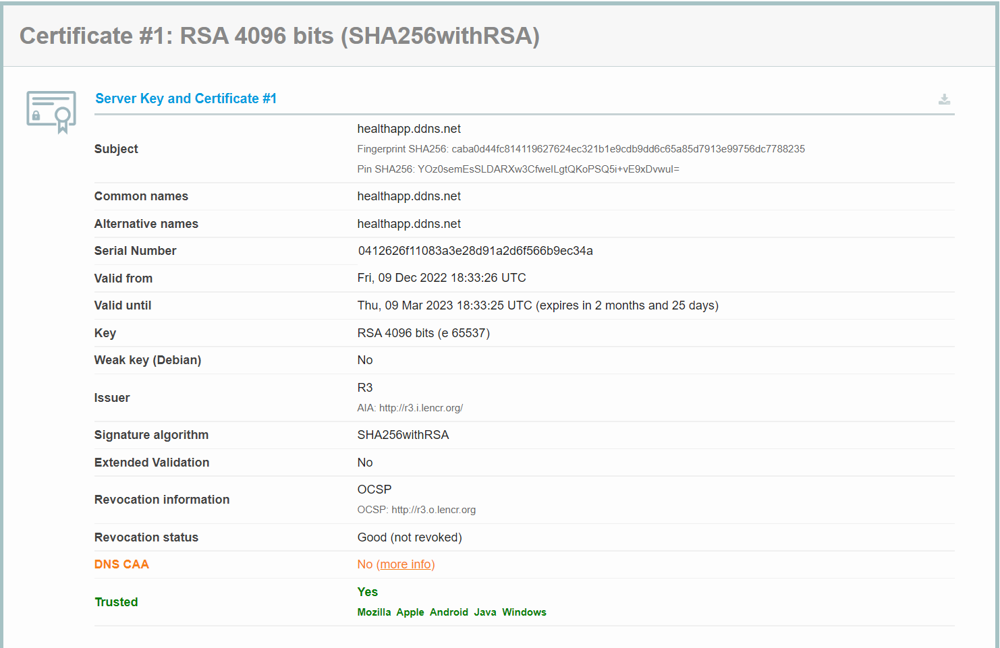
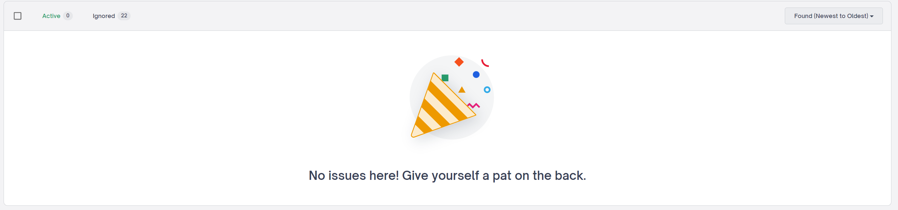

# Dokumentation SbD - Projekt HealthApp <!-- omit in toc -->

## Inhaltsverzeichnis <!-- omit in toc -->
- [Technologien und Tools](#technologien-und-tools)
  - [Django](#django)
  - [Gunicorn](#gunicorn)
  - [Nginx](#nginx)
  - [Docker](#docker)
  - [PostgreSQL](#postgresql)
- [Architektur](#architektur)
- [Schutzobjekte und Schutzziele](#schutzobjekte-und-schutzziele)
- [Risikoregister](#risikoregister)
- [Implementierung](#implementierung)
  - [User Registrierung](#user-registrierung)
    - [E-Mail Bestätigung](#e-mail-bestätigung)
  - [User Login](#user-login)
  - [Datei Verschlüsselung](#datei-verschlüsselung)
  - [Einschränkungen beim File-Upload](#einschränkungen-beim-file-upload)
  - [Session-Management](#session-management)
  - [Clickjacking Protection](#clickjacking-protection)
  - [Object Relational Mapper - ORM](#object-relational-mapper---orm)
  - [Cross Site Scripting Protection](#cross-site-scripting-protection)
  - [Cross site request forgery (CSRF) protection](#cross-site-request-forgery-csrf-protection)
  - [SSL/HTTPS](#sslhttps)
  - [Password Hashing](#password-hashing)
- [Funktionalitäten](#funktionalitäten)
  - [Passwort Reset](#passwort-reset)
  - [Doktor Lizensierung](#doktor-lizensierung)
  - [File Sharing](#file-sharing)
  - [Patient Request](#patient-request)
  - [Datei Verwaltung](#datei-verwaltung)
- [Testplan](#testplan)
- [Testergebnisse](#testergebnisse)

## Technologien und Tools
### Django
Django ist ein High-Level-Python-Webframework, das eine schnelle Entwicklung und ein sauberes, pragmatisches Design fördert. Es wurde von erfahrenen Entwicklern erstellt und nimmt Ihnen einen Großteil der Webentwicklung ab, sodass Sie sich auf das Schreiben Ihrer App konzentrieren können, ohne das Rad neu erfinden zu müssen. Es ist kostenlos und Open Source.
### Gunicorn
Gunicorn ist ein Python-WSGI-HTTP-Server für UNIX. Der Gunicorn-Server ist weitgehend kompatibel mit verschiedenen Web-Frameworks, ist vergleichsweise einfach implementiert, verbraucht wenig Serverressourcen und ist vergleichsweise schnell
### Nginx
Nginx (Engine X) ist ein Open-Source-Webserver, der für die Verarbeitung von HTTP-Anfragen und die Bereitstellung von Inhalten konzipiert ist. Nginx ist ein beliebter Webserver, der für seine hohe Geschwindigkeit und seine Fähigkeit bekannt ist, große Anfragen zu verarbeiten. Nginx ist ein beliebter Webserver, der für seine hohe Geschwindigkeit und seine Fähigkeit bekannt ist, große Anfragen zu verarbeiten.
### Docker
Docker ist eine Software, die es Entwicklern ermöglicht, Anwendungen in isolierten Umgebungen zu erstellen, zu testen und zu bereitstellen.
### PostgreSQL
PostgreSQL ist ein objektrelationales Datenbankmanagementsystem (ORDBMS) mit dem Fokus auf Standardskonformität und Erweiterbarkeit.

## Architektur

## Schutzobjekte und Schutzziele


## Risikoregister


## Implementierung

### User Registrierung
Ein User registiert sich bei der Applikation mit seinen persönlichen Daten und einer gültigen E-Mail. Bei der Angabe des Passworts müssen festgelegte Passwortregeln beachtet werden: 

1. Das Passwort darf den Angaben zu den persönlichen Daten nicht zu ähnlich sein. 
2. Es  muss aus mindestens 8 Zeichen bestehen. 
3. Das Passwort sollte kein häufig verwendetes Passwort sein  
4. Es darf nicht ausschließlich aus Zahlen bestehen.

Code:
```python
class MinimumLengthValidator:
    """
    Validate that the password is of a minimum length.
    """

    def __init__(self, min_length=8):
        self.min_length = min_length

    def validate(self, password, user=None):
        if len(password) < self.min_length:
            raise ValidationError(
                ngettext(
                    "This password is too short. It must contain at least "
                    "%(min_length)d character.",
                    "This password is too short. It must contain at least "
                    "%(min_length)d characters.",
                    self.min_length,
                ),
                code="password_too_short",
                params={"min_length": self.min_length},
            )

    def get_help_text(self):
        return ngettext(
            "Your password must contain at least %(min_length)d character.",
            "Your password must contain at least %(min_length)d characters.",
            self.min_length,
        ) % {"min_length": self.min_length}


def exceeds_maximum_length_ratio(password, max_similarity, value):
    """
    Test that value is within a reasonable range of password.

    The following ratio calculations are based on testing SequenceMatcher like
    this:

    for i in range(0,6):
      print(10**i, SequenceMatcher(a='A', b='A'*(10**i)).quick_ratio())

    which yields:

    1 1.0
    10 0.18181818181818182
    100 0.019801980198019802
    1000 0.001998001998001998
    10000 0.00019998000199980003
    100000 1.999980000199998e-05

    This means a length_ratio of 10 should never yield a similarity higher than
    0.2, for 100 this is down to 0.02 and for 1000 it is 0.002. This can be
    calculated via 2 / length_ratio. As a result we avoid the potentially
    expensive sequence matching.
    """
    pwd_len = len(password)
    length_bound_similarity = max_similarity / 2 * pwd_len
    value_len = len(value)
    return pwd_len >= 10 * value_len and value_len < length_bound_similarity


class UserAttributeSimilarityValidator:
    """
    Validate that the password is sufficiently different from the user's
    attributes.

    If no specific attributes are provided, look at a sensible list of
    defaults. Attributes that don't exist are ignored. Comparison is made to
    not only the full attribute value, but also its components, so that, for
    example, a password is validated against either part of an email address,
    as well as the full address.
    """

    DEFAULT_USER_ATTRIBUTES = ("username", "first_name", "last_name", "email")

    def __init__(self, user_attributes=DEFAULT_USER_ATTRIBUTES, max_similarity=0.7):
        self.user_attributes = user_attributes
        if max_similarity < 0.1:
            raise ValueError("max_similarity must be at least 0.1")
        self.max_similarity = max_similarity

    def validate(self, password, user=None):
        if not user:
            return

        password = password.lower()
        for attribute_name in self.user_attributes:
            value = getattr(user, attribute_name, None)
            if not value or not isinstance(value, str):
                continue
            value_lower = value.lower()
            value_parts = re.split(r"\W+", value_lower) + [value_lower]
            for value_part in value_parts:
                if exceeds_maximum_length_ratio(
                    password, self.max_similarity, value_part
                ):
                    continue
                if (
                    SequenceMatcher(a=password, b=value_part).quick_ratio()
                    >= self.max_similarity
                ):
                    try:
                        verbose_name = str(
                            user._meta.get_field(attribute_name).verbose_name
                        )
                    except FieldDoesNotExist:
                        verbose_name = attribute_name
                    raise ValidationError(
                        _("The password is too similar to the %(verbose_name)s."),
                        code="password_too_similar",
                        params={"verbose_name": verbose_name},
                    )

    def get_help_text(self):
        return _(
            "Your password can’t be too similar to your other personal information."
        )


class CommonPasswordValidator:
    """
    Validate that the password is not a common password.

    The password is rejected if it occurs in a provided list of passwords,
    which may be gzipped. The list Django ships with contains 20000 common
    passwords (lowercased and deduplicated), created by Royce Williams:
    https://gist.github.com/roycewilliams/281ce539915a947a23db17137d91aeb7
    The password list must be lowercased to match the comparison in validate().
    """

    @cached_property
    def DEFAULT_PASSWORD_LIST_PATH(self):
        return Path(__file__).resolve().parent / "common-passwords.txt.gz"

    def __init__(self, password_list_path=DEFAULT_PASSWORD_LIST_PATH):
        if password_list_path is CommonPasswordValidator.DEFAULT_PASSWORD_LIST_PATH:
            password_list_path = self.DEFAULT_PASSWORD_LIST_PATH
        try:
            with gzip.open(password_list_path, "rt", encoding="utf-8") as f:
                self.passwords = {x.strip() for x in f}
        except OSError:
            with open(password_list_path) as f:
                self.passwords = {x.strip() for x in f}

    def validate(self, password, user=None):
        if password.lower().strip() in self.passwords:
            raise ValidationError(
                _("This password is too common."),
                code="password_too_common",
            )

    def get_help_text(self):
        return _("Your password can’t be a commonly used password.")


class NumericPasswordValidator:
    """
    Validate that the password is not entirely numeric.
    """

    def validate(self, password, user=None):
        if password.isdigit():
            raise ValidationError(
                _("This password is entirely numeric."),
                code="password_entirely_numeric",
            )

    def get_help_text(self):
        return _("Your password can’t be entirely numeric.")
```

#### E-Mail Bestätigung
Registirerung eines Users wird erst durch die Validierung eines Accounts anhand der E-Mail möglich. 

Dazu wird ein Verifizierungslink generiert und zu der angegebenen Nutzer E-Mail-Adresse geschickt. Die Verifizierung geschieht dann über einen gehasten Token der in der Email mitgeliefert wird und den User eindeutig identifiziert. Falls die Prüfung des Tokens erfolgreich ist wird der User aktiviert und kann sich einloggen. Sollte innerhalb von 24 Stunden keine Verifizierung erfolgen wird der User gelöscht. 

### User Login
Zum einloggen wird die Kombination aus einem Benutzernamen und Passwort benötigt. 

### Datei Verschlüsselung
Alle Dateien werden vor dem abspeichern mit AES-CTR verschlüsselt. Bei einem Data Breach können die Daten somit nicht gelesen werden. 


### Einschränkungen beim File-Upload
Um den Fiel-Upload etwas einzuschränken und Risiken zu mindern aber auch gleichzeitig die Funktionalität zu bewahren wurden zwei Einschränkungen implementiert. Es wird die File-Größe auf maximal 10 MB beschränlz und nur Dateien des Typs PDF zugelassen. Alle anderen Datentypen können nicht hochgeladen werden. Anpassungen können jedoch je nach Anforderung ohne Probleme durch das setzen eines Parameters implementiert werden.
> Note: Für die Überprüfung des File-Typs wird die Dateiendung abgefragt. Dies sagt jedoch nicht zwangsläufig etwas über den Inhalt der Datei aus. Hierfür müsste man den Inhalt mithilfe eines Malware-Analyse-Tools überprüfen. Dies ist jedoch im Rahemn dieses Projekts nicht möglich gewesen.

### Session-Management
Bei jeder Authentifizierung wird eine neue Session-ID erstellt, die nicht in der URL zu finden ist. Session-IDs werden über einen Cookie gespeichert. Die Session Informationen werden in der Datenbank gespeichert, damit dem user so wenig Informationen wie möglich übermittelt werden.

### Clickjacking Protection
Django besitzt die sog. X-Frame-Options middleware. 
Diese verhindert, dass Seiten innerhalb eines Frames gerendert werden 
Hierbei werden die X-Frame-Options Header für alle Responses gesetzt.
Standardmäßig wird der Header auf DENY gesetzt. Damit blockiert der Browser das Laden der Ressource in einem Frame, unabhängig davon, von welcher Website die Anfrage stammt.

### Object Relational Mapper - ORM
Datenbank interaktion ohne SQL Statements werden im Code über Python Klassen realisiert. Querys werden mithilfe von Query Parameterization erstellt um SQL Injection zu verhindert.

### Cross Site Scripting Protection
Um den Schutz zu implementieren wurden folgende Umformungen definiert:
Automatic HTML escaping:

'<' is converted to &lt

'>' is converted to &gt

' (single quote) is converted to &#x27

" (double quote) is converted to &quot

& is converted to &amp

### Cross site request forgery (CSRF) protection
In jedem POST request muss ein Secret vom Nutzer mitgeschickt werden, welches überprüft wird.
Dadurch wird sichergestellt, dass ein böswilliger Benutzer ein POST-Formular auf der Website nicht „wiederholen“ kann und einen anderen angemeldeten Benutzer dazu bringt, dieses Formular unwissentlich zu übermitteln. Der böswillige Benutzer müsste das Geheimnis kennen, das benutzerspezifisch ist.

### SSL/HTTPS
Die Anwendung läuft hinter HTTPS und verwendet die aktuelle TLS Version 1.3.



### Password Hashing
Alle Passwörter werden gehasht abgespeichert. Hierfür wird der [PBKDF2 Algorithmus](https://de.wikipedia.org/wiki/PBKDF2) verwendet.

## Funktionalitäten

### Passwort Reset
Die User haben die Möglichkeit ihr Passwort jederzeit zuändern.
Über ihre E-Mail Adresse können User ein neues Passowrt erstellen, sollten sie ihr aktuelles vergessen haben.

### Doktor Lizensierung
Damit man eine Doktorrolle zugewiesen bekommt man man sich vorerst Lizensieren.
Die Lizensierung der Doktoren geschieht über den Upload einer PDF; der Lizenz Datei.
Diese Datei muss manuell von einem Admin, mit besonderen Rechten geprüft und bestätigt werden, damit der angefragte Nutzer zum Doktor wird.

### File Sharing
Patienten können ihre Dateien nur mit Doktoren teilen bei denen sie Patienten sind.
Dadurch soll ein versehentliches teilen mit einem falschen Doktor vorgebeugt werden.
Patienten aaben die Möglichkei können einzelne Files mit ihren Doktoren zu teilen und können ihre geteilten Files jederzeit einsehen sowie auch herunterladen.
Die Doktoren, mit denen die Dateien geteilt wurden, können die geteilten Files einsehen und ebenfalls herunterladen.

### Patient Request
Damit eine Beziehung zwischen einem Patienten und Doktor Beziehung entsteht, muss ein User (Patient) einen Doktor anfragen. Der angefragte Doktor kann diesen Patienten annehmen oder ablehnen. Erst bei Annahme der Anfrage entsteht eine Beziehung zwischen dem Patienten und dem Doktor. Daraufhin erscheint der Doktor unter MyDoctors beim Nutzer. 

### Datei Verwaltung
Patienten haben die Möglichkeit ihre Dateien anzupassen, zu löschen und herunterzuladen. 


## Testplan
|Test Case Type|Beschreibung|Test Schritte|Erwartetes Ergebnis|Status|
|----------|----------|--------|--------|----------|
| Functionality|Testen ob Nutzer erstellt und gelöscht werden kann|Mehrere Nutzer erstellen und danach löschen|Nutzer lässt sich erfolgreich erstellen und wieder löschen|Passed|
||Testen ob Login/Logout funktioniert|Erstellte Testnutzer einloggen und auf gültige bzw. nach dem Logout ungültige Session prüfen|Nach dem einloggen wird eine gültige Session erstellt und diese wird nach dem ausloggen ungültig und ist nicht mehr nutzbar|Passed|
||Testen ob Nutzer aktiv oder inaktiv - bei Inaktiv User löschen|Prüfen ob erstellte Nutzer ihre E-Mail verifiziert haben (und somit inactiv sind), falls die Verifizierung nicht erfolgt wird kein Konto erstellt und der Nutzer wieder gelöscht|Nicht verifizierte Konten werden identifiziert und dann gelöscht|Passed|
||Testen ob Patient/Doktor erstellbar|Nutzer mit Rollenzuweisung(Patient/Doktor) erstellen|Nutzer werden erstellt und entweder der Rolle Patient oder Doktor erfolgreich zugewiesen|Passed|
||Testen ob File Upload/Download funktioniert  |Eine PDF Datei hochladen/runterladen und auf gültige Rückmeldung prüfen|Es lässt sich eine PDF Datei hochladen und auch wieder herunterladen|Passed|
|Security|Zugriff auf Myfiles/shared files ohne Patientenrolle testen|MyFiles und SharedFiles aufrufen ohne eingeloggt oder registriert zu sein |Es ist nicht möglich auf MyFiles oder SharedFiles zuzugreifen|Passed|
||Zugriff auf Profile ohne Patientenrolle testen|Profile aufrufen ohne ein Patientenrolle zu haben - also nicht eingeloggt oder registriert |Profil darf nicht abrufbar sein|Passed|
||Zugriff auf All Doctors/My Doctors ohne Patientenrolle testen| All Doctors/ My Doctors - Seite aufrufen ohne ein Patientenrolle zu haben       |Zugriff auf die Seite darf nicht möglich sein ohne ein Patientenrolle zu haben|Passed|
||Zugriff auf Patient Data/Patient Request ohne Doktorrolle testen| Patient data bzw. Patient Request aufrufen ohne Doktorrolle zu besitzen     |Es darf keine Datenabruf möglich sein, wenn man keine Doktorrolle hat und Doktor vom jeweiligen Patienten ist|Passed|
||Testen ob Email Verifzierung mit falschem Token|Falschen Token für nicht aktiven Nutzer erstellen und mit GET-Request prüfen ob damit die E-Mail verifizierbar ist|Eine E-Mail Verifizierung mit dem falschen Token darf nicht erfolgen|Passed|


## Testergebnisse
Zum aktuellen Stand (12.12.2022) werden alle oben aufgeführten Test von unserer ANwendung bestanden.

Zusätzlich haben wir eine statische Codeanalyse mithilfe von CodeQL in unseren Testvorgang implementiert. Dieser konnte jedoch keine Schwachstelle in unserem Code finden: 

Da wir in diesem Projekt viele Open-Source Libraries eingebunden haben, haben wir uns dazu entschieden FOSSA als open source dependencies Tool einzubinden. FOSSA prüft bei jedem Push auf den `main` branch die eingebundene open source Bibliotheken auf ihre Lizensen und gemeldete Schwachstellen:


Die gefunden Issues können dann manuell reviewed und das Projekt angepasst bzw. die erforderlichen Lizensbedingungen akzeptiert werden:


FOSSA generiert zudem einen Bericht mit allen Dependencies:
https://app.fossa.com/attribution/e255cdb3-2448-49e1-89d8-503bb1d49d38
